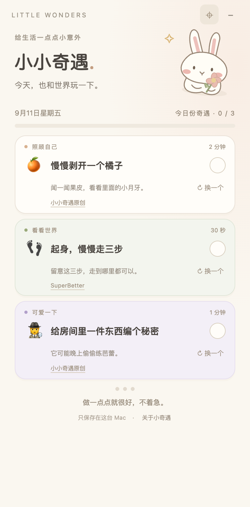
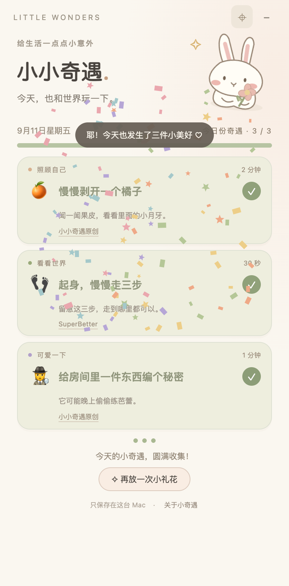

# 小小奇遇 🐰

> *献给每一个「今天也只做了一点点」的日子。*

<p align="center"></p>

## 它是干什么的

有些日子，连「起床」都像一座山。这种时候别提什么宏大计划了，能做成一件三十秒的小事，就已经很了不起。

小小奇遇就是为这种日子准备的。它每天给你三件事：

- 🫧 **照顾自己** ── 比如「用温水洗一次脸」「双手捧着一杯温水，小口喝三口」
- 🔎 **看看世界** ── 比如「在附近找一点绿色」「给家里的角落取一个地名」
- 🥔 **可爱一下** ── 比如「给土豆画一个想象中的脸」「给一只袜子起个艺名」

每件事大概 30 秒到 3 分钟。做完一件，点一下小圆圈。三件都做完，兔子会给你放一场小小的礼花。

<p align="center"></p>

## 怎么玩

1. 点菜单栏的 🐰，或者双击桌面上的「小小奇遇」。
2. 看看今天的三件事。想做哪件就做哪件，顺序随意。
3. 做完了点右边的小圆圈。点错了再点一次就撤销。
4. 三个都点亮了，会有礼花。想再看一次，有个「再放一次小礼花」的按钮。

窗口顶部那行英文字可以拖着走。⌖ 是「保持在其他窗口上面」，− 是「先收起来」。关掉再打开，今天的进度还在。

新的一天按你这台 Mac 的日期来。半夜十二点一过，兔子就会悄悄换上三张新卡。

## 想养一只吗

它是一个 macOS 小应用（macOS 13 以上，Apple Silicon）。在这个文件夹里跑两行命令就好：

```bash
bash scripts/build.sh
```

```bash
bash scripts/install.sh
```

第二行会把它放进 `~/Applications`，在桌面留一个快捷方式，并且设置成登录时自动打开。

### 想让它休息一下

不想它开机就出现，可以关掉登录启动（应用和进度都会留着）：

```bash
launchctl bootout "gui/$(id -u)/local.littlewonders.desktop" && mv ~/Library/LaunchAgents/local.littlewonders.desktop.plist{,.disabled}
```

想让它回来，重新跑一次 `install.sh` 就行。

### 想和它告别

先做上面那步，然后把 `~/Applications/小小奇遇.app` 和桌面上的快捷方式拖进废纸篓。它记的东西在 `~/Library/Application Support/LittleWonders/`。

## 这些小事是哪来的

一部分是原创的，一部分改编自几个认真研究「怎么让人稍微好受一点」的地方：

- [Action for Happiness](https://actionforhappiness.org/calendar-monthly) 的每月行动日历
- [SuperBetter](https://janemcgonigal.com/2014/01/06/) 里那些「给响指数到五十」式的小挑战
- [CCI](https://cci.health.wa.gov.au/-/media/CCI/Consumer-Modules/Back-from-The-Bluez/Back-from-the-Bluez---02---Behavioural-Strategies.pdf) 的「有趣活动清单」

每张卡片底下都写着出处，点一下能看到改编说明。改编成中文短句的时候，只借了点子，没有借任何「这样做你就会好起来」的承诺。

## 一句认真的话

这个小工具背后的想法叫「行为激活」：心情低落的时候，先做一件很小的事，不等有心情了再做。这是 [NHS 也在用的一种方法](https://www.gmmh.nhs.uk/behavioural-activation)。
